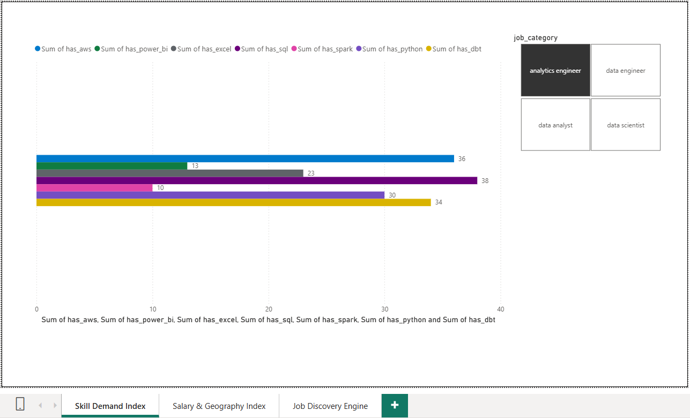
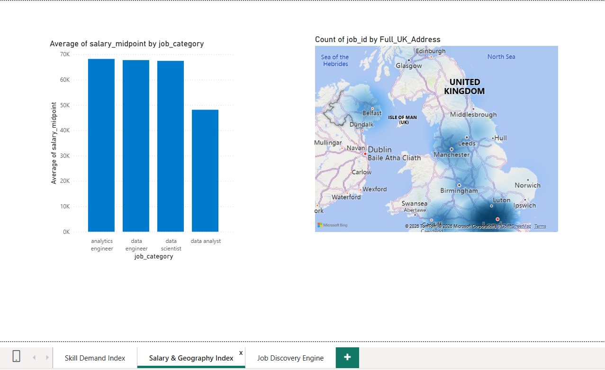
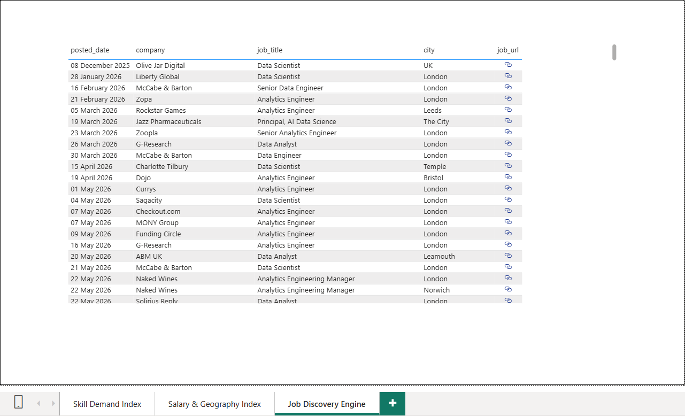

# 📊 End-to-End Automated UK Job Market Intelligence Platform

An automated production-grade data engineering platform that extracts, cleans, orchestrates, and visualizes real-time UK data profession job postings. This project monitors market fluctuations, tracks shifts in technical skill demands, and charts regional compensation benchmarks.

---

## 🖼️ Executive Dashboard Interface

### Page 1: Skill Demand Index

*Provides a live ranking of primary core technologies (SQL, Python, dbt, etc.) demanded by hiring managers, dynamically sliceable by specific data career tracks.*

### Page 2: Salary & Geography Index

*Maps national compensation averages across job roles alongside an interactive geographic bubble layer illustrating hiring density hotspots across the UK.*

### Page 3: Job Discovery Engine

*A functional operational ledger allowing recruiters and practitioners to search active listings and launch direct application links via live embedded URL handles.*

---

## 🛠️ Tech Stack & Architecture

- **Data Ingestion:** Python 3.14 (`requests`, `BeautifulSoup`, `pandas`)
- **Pipeline Orchestration:** Prefect Cloud Workflow Engine
- **Cloud Data Warehouse:** Google BigQuery
- **Analytics Engineering:** dbt (Data Build Tool) Core
- **Business Intelligence:** Power BI Desktop

---

## 📐 Data Pipeline & Engineering Layer

### 1. Automated Extraction (`ingestion/`)
- Connects daily to the Adzuna Developer API to capture live vacancy payloads.
- Runs a multi-threaded web scraper utilizing specialized humanized `User-Agent` header configurations to bypass strict Applicant Tracking System (ATS) firewalls and securely harvest full job description text blocks.

### 2. Sequential Orchestration (`prefect/` & `.bat`)
- Managed natively via a sequential automation chain wrapped in a Windows Task Scheduler script (`run_pipeline.bat`).
- Implements missed-run recovery catch-ups to guarantee data streaming stability if execution windows are dropped due to machine sleep states.

### 3. Warehouse Transformations (`dbt/`)
Processes raw JSON data lakes into clear star-schema data marts via a 3-tier compilation structure:
- **`Staging Layer`:** Enforces schema validation and types cast configurations.
- **`Intermediate Layer`:** Runs advanced SQL windowing functions (`ROW_NUMBER() OVER(...)`) to isolate and strip duplicate listings, and executes case-insensitive pattern matching (`LIKE`) to clean text-mine underlying tool demand flags (`SQL`, `Python`, `dbt`, `Power BI`).
- **`Marts Layer`:** Materializes the final analytical fact layer (`fct_job_market_insights`).

---

## 🚀 Local Deployment Setup

### 1. Environment & Dependencies
Clone this repository and initialize your package dependencies:
```bash
pip install -r requirements.txt

